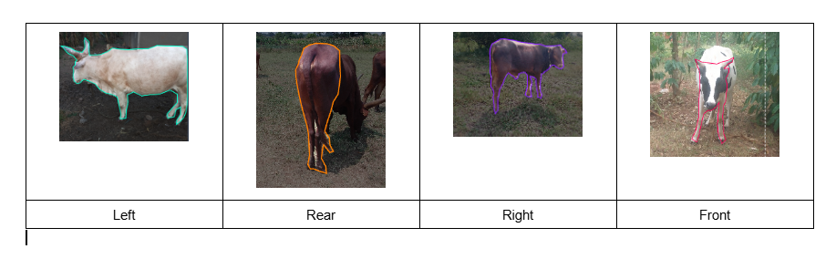

# M-Vet_Hackathon24

This repository contains resources for the [Makerere Artificial Intelligence Lab](https://air.ug/) Computer Vision for agriculture Hackathon.  
The Hackathon is running from start date to end date .  
The competition will focus on building computer vision models for Well Identification & Measurement Prediction and Animal posture prediction.  
Through this, university students will gain experience in building solutions for deployment in the field.

## The problem

The task is to develop 2 computer vision models for object detection tasks.

### Animal Posture Detection

Participants will develop models to predict the posture of an animal. LPossible labels include Front, Rear, Left and Right.

### Well Identification and Measurement

For the object detection task, participants will develop models to detect various stages of the cocoa fruit in the coccoa tree images:

# Quick Links

1. [Datasets](https://github.com/AI-Lab-Makerere/CV4Agriculture_Hackathon24/blob/main/guides/Datasets.md)
2. [Well Identification and Measurement Tutorial](https://github.com/AI-Lab-Makerere/CV4Agriculture_Hackathon24/blob/main/tutorial/Cocoa_Object_Detection_with_YOLO8.ipynb)
3. [Animal Posture Detection Tutorial](https://github.com/AI-Lab-Makerere/CV4Agriculture_Hackathon24/blob/main/tutorial/Maize_Disease_Classfication_with_Tensorflow_Keras_.ipynb)
4. [Making a Submission](https://github.com/AI-Lab-Makerere/CV4Agriculture_Hackathon24/blob/main/guides/Submissions.md)
5. [Frequently Asked Questions](https://github.com/AI-Lab-Makerere/CV4Agriculture_Hackathon24/blob/main/guides/FAQs.md)
6. [Prizes](https://github.com/AI-Lab-Makerere/CV4Agriculture_Hackathon24/blob/main/guides/Prizes.md)
